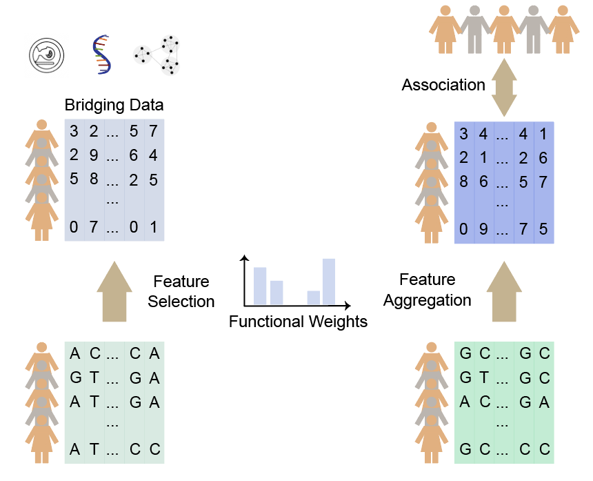

## Users’ Manual of IMAS

## Overview
Brain imaging such as fMRI and genomic sequencing have become critical tools enabling characterization of brain disorders. Researchers may conduct genome-wide association studies (GWAS) to identify genetic basis; alternatively, one can use brain images to study functional alternations. Multi-scale data of genotype, brain image, and disease phenotype assessed on a single cohort are available from larger consortium efforts, however these studies are still limited. Imaging large cohorts is expensive, and imaging is unavailable for many legacy datasets. To address this problem, we developed Image-Mediated Association Study (IMAS), which first uses a dataset containing images and genotype (e.g., UK Biobank) to select image-relevant genetic variants, and then, using a dataset with genotype and phenotype (e.g., GWAS), aggregates selected genetic variants for association mapping via multiple linear regression or a kernel method. By conducting simulations and analyzing the UK Biobank image-derived phenotypes (IDPs) together with GWAS data of four neuropsychiatry disorders, we highlight two advantages of IMAS: 1) it improves the power of both genotype-phenotype and the IDP-phenotype association analyses than either alone, 2) a striking advantage of IMAS is that, assuming the IDP-phenotype association rooted in genetics, IMAS that does not require IDPs and phenotype in the same dataset could be more powerful than applying a naïve method to the GWAS only dataset.  This shows that, by utilizing brain images (e.g., from UK Biobank), one can reanalyze legacy GWAS datasets from the perspective of brain images, enabling new research and bringing cost-savings for integrated analysis of genetics, imaging, and brain disorders.

## The IMAS model framework:
### Step 1: Preprocessing of UK Biobank IDP phenotypes

Select IDPs as our data-bridge, and conduct a filtering, leaving a subset of terms. Initially, we collected 488,377 individuals in UK Biobank with 891 IDPs and non-missing values for other covariates such as genetic PCs, sex, and age at recruitment. First, each IDP’s data vector had outliers removed (set to missing, with outliers determined by being greater than six times the median absolute deviation from the median). Then, we discarded individuals for whom 50 or more IDPs were missing. Each IDP’s data vector was normalized, resulting in it being Gaussian distributed, with mean = 0 and s.d. = 1. Lastly, we regressed out covariates, including the top 10 genetic principal components supplied by UKB (UK Biobank DataField 22009), age, sex, squared age, age × sex, squared age × sex, head size (UK Biobank DataField 25000), head motion (UK Biobank DataField 25741), and scanner positions (UK Biobank DataField 25756, 25757, 25758, 25759). 

### Step 2: Select genetic variants (and their weights) using the data-bridge cohort (that contains genotype and the bridging data) (Fig. 1A). 

The selection may be conducted by (1) a regularized or Bayesian multi-regression (as in the original TWAS protocols [REF], (2) the simple method using marginal effects only, or (3) any other advanced ML models. For feature selection, we integrated two models:  regularized regression (Elastic Net) and linear mixed model (EMMAX).

This model is equivalent to EMMAX [PMID: 20208533] and in this work we used our out-of-core implementation to conduct the analysis [PMID: 23479353]. The SNPs with nominal P-value lower than a user-prespecified cutoff will be retained for next step of aggregation test. 

### Step 3: One may conduct the above selection for multiple rounds using different data-bridges and aggregate all the selected variants into a single statistic for an association test (Fig. 1B). 

The method for aggregation may be multiple linear regression (as in the original TWAS protocols [REF]) or a kernel machine [REF] which is more robust to noise, as suggested in ML field[REF] and showed by us in genetics [REF], or any other ML models. Then conduct an association test between this statistic and the traits under investigation. For feature aggregation, we integrated two models: the multiple linear regression and the kernel machine (SKAT).

We recommend allowing a relatively large number of potential SNPs (e.g., SNPs with nominal p-values < 0.01 before multiple-test correction) to be aggregated in the second SKAT. This is because our previous work in TWAS revealed that the performance of SKAT favors a large number of weakly correlated variants over a small number of highly significant variants [PMID: 33200776], possibly due to the advantage of kernel methods being more robust to noise. 

### Installation
IMAS is a batteries-included JAR executable. All needed external jar packages are included in the downloadable, IMAS.jar. To download all necessary files, users can use the command 
`git clone https://github.com/JingniHe/IMAS.git`
As we used an R package SKAT, the users have to install R and SKAT (https://cran.r-project.org/web/packages/SKAT/index.html.) The versions of R and R package SKAT that we have used on our platform are: version 2.0.0 for SKAT and version 3.5.1 for R. Other versions are not tested, although they may work. Users are also expected to have java (version: 1.8) on their platform. plink (v1.07, https://zzz.bwh.harvard.edu/plink/download.shtml) should also be installed.

Usage:

`java -jar IMAS.jar IMAS -format csv|plink -input_genotype INPUT_GENOTYPE_FILE -input_phenotype INPUT_PHENOTYPE_FILE -input_phenotype_column INPUT_PHENOTYPE_COLUMN_START:2 -input_phenotype_type PHENOTYPE_TYPE: continuous|binary 
-en_info_path INPUT_ELASTICNET_INFORMATION_FILE  -gene INPUT_ENSEMBL_GENE_ID  -plink PLINK_BINARY_FILE_PATH  -Rscript RSCRIPT_BINARY_FILE_PATH -output_folder OUTPUT_FOLDER_PATH`

Installation and a simple example are described below. Users can get the final p-value result under the folder: OUTPUT_FOLDER_PATH. 
You may try our example after "git clone". If trying csv format, the command line is:

`java -jar kTWAS.jar kTWAS -format csv -input_genotype EXAMPLE/CSV_FORMAT/example.csv -input_phenotype EXAMPLE/CSV_FORMAT/example.tsv -input_phenotype_column 2 -input_phenotype_type binary -en_info_path ElasticNet_DB/ElasticNet_Whole_Blood.txt -gene ENSG00000250334.5 -plink /PATH/TO/plink -Rscript /PATH/TO/Rscript -output_folder /PATH/TO/OUT_FOLDER`

Otherwise, if users want to try plink format, the command line is:

`java -jar kTWAS.jar kTWAS -format plink -input_genotype EXAMPLE/PLINK_FORMAT/example.tped -input_phenotype EXAMPLE/PLINK_FORMAT/example.tfam -input_phenotype_column 6 -input_phenotype_type binary -en_info_path ElasticNet_DB/ElasticNet_Whole_Blood.txt -gene ENSG00000250334.5 -plink /PATH/TO/plink -Rscript /PATH/TO/Rscript -output_folder /PATH/TO/OUT_FOLDER`

Please note that, to consistent with plink format, the phenotype is set to missing (normally represented by -9) if unspecified. It must be a numeric value. Case/control phenotypes are normally coded as control = 1, case = 2.The kTWAS.result under /PATH/TO/OUT_FOLDER is the final output file by kTWAS. More description and benchmarking of kTWAS can be found in our publication:https://www.biorxiv.org/content/10.1101/2020.06.29.177121v1.full.pdf
